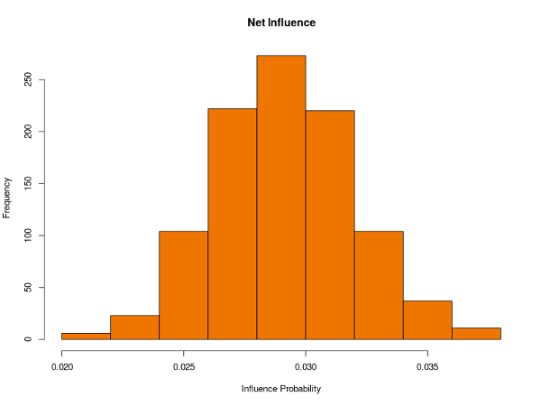
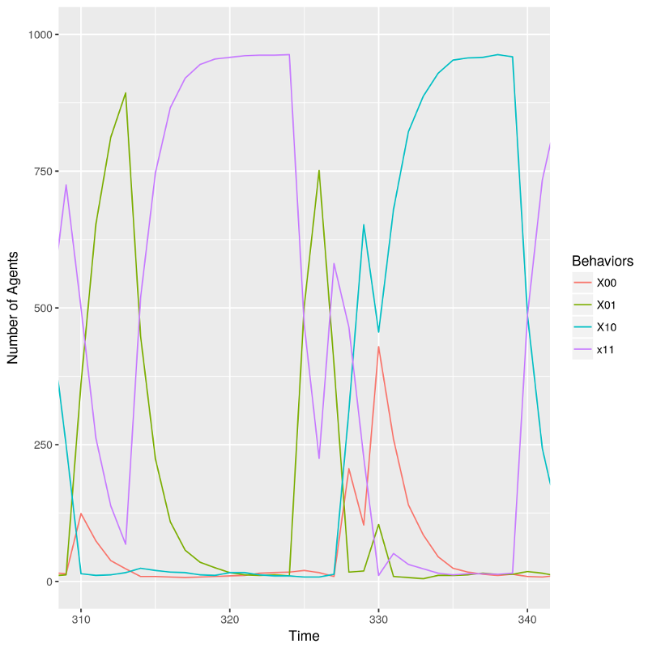

---

Clone or download from [Github](https://github.com/wbknez/iris).

Language: **C++**

## Objective

This project aims to explore oppression, representation, and power dynamics as
the collective output of interpersonal interactions arising from transmission of
and response to normative behavior mediated by social networks through agent
based simulation.

## Methodology

This project is the programmatic implementation of my (UNM Math 499) independent
study research paper. It is inspired by the work of Iris Marion Young;
specifically, her essay the "Five Faces of Oppression" (1990). One of her
primary ideas is that oppression need not necessarily be conceptualized as
adversarial; that the ordinary workings of a liberal society could, in their own
way, still produce a social structure that constrains some and disadvantages
others along group lines (Young, 2009).

To investigate this, this project constructs a virtual society of agents, all of
whom have normative values, behaviors, and social bonds to others through both
friendship and family. Every time step, each agent interacts with a select
sample of other agents from outside her social network and, through
conceptualized interpersonal interactions, gains either acceptance or rejection
of the values and behaviors that she currently possesses. Instead of immediately
acting upon this feedback, however, she then meets with a select group of people
from inside her social circle as a form of comparison. The outcome of these two
interactions determines whether or not she will keep or change her behavior for
the current round. Some agents (due to simulation parameters) have more
effective influence than others; it is part of the goal of this project to
investigate how their composition might affect the resulting network structures.

## Results

+ Influence distribution for an entire population.

+ Cyclic shifts in representation.

## References

1. Young, I.M. (2009). Five faces of oppression. In G.L. Henderson & M. Waterstone (Eds.), Philosophical forum (p270). Routledge.

---
