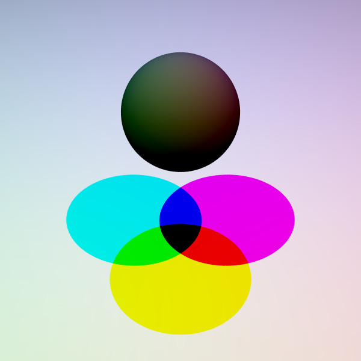
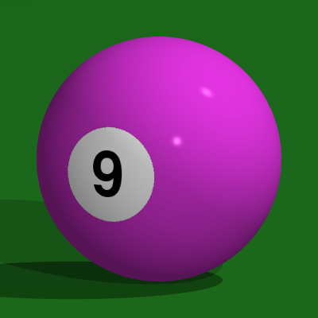
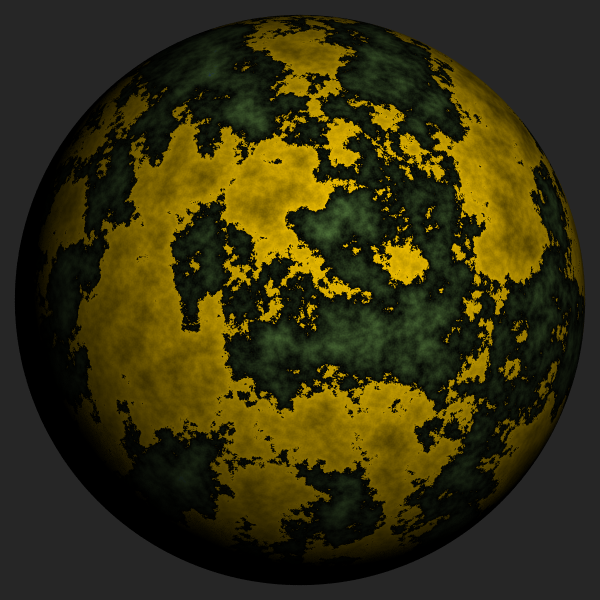

---

Clone or download from [Github](https://github.com/wbknez/kalahari).

Language: **Kotlin**

## Objective

My goal with this project was to recreate and improve upon the design of Kevin
Suffern's excellent work in *Ray Tracing from the Ground Up*.  In particular, I
wanted to create a cohesive object-oriented scenegraph design and use the
`rxstream` library to mimic the OpenGL rendering pipeline - especially fragment
processing.  In addition, I used LuaJ to explore extending Kotlin with a
JVM-compatible scripting language which allowed me to separate scene definitions
from the rendering library itself.

## Features

+ Mathematical geometries such as spheres, discs, cylinders, torii, and triangles.
+ Composable scenegraph allowing per-instance transformations and shadows.
+ Image and procedurally generated texturing.
+ Matte, Phong, and emissive shading.
+ Fish, pinhole, spherical, stereo, and thin lens cameras.
+ All objects bound and usable with Lua for scene construction.

## References

1. Suffern, K. (2007). *Ray tracing from the ground up*. A.K. Peters, Ltd.

## Screenshots

+ Tri-color shadows and material blending:

+ Image-based texturing with reflection and shadows:

+ Procedurally generated textures using layered Brownian motion:

---
