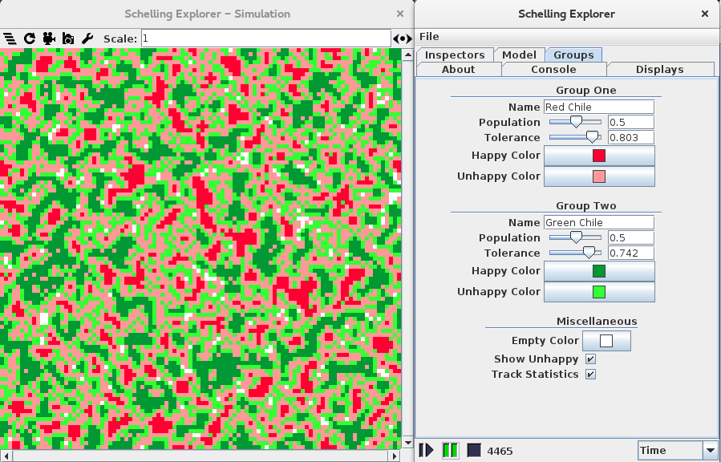

---

Clone or download from [Github](https://github.com/wbknez/schelling).

Language: **Java**

## Objective

With this project, I aimed to to re-create and explore several variations of
Thomas Schelling's (1969-71) famous model.  I had just completed my first
academic research paper as an undergraduate and was intruiged by the sheer
variation in these models - not only in implementation, but in the resulting
dynamics.

## Features

+ Three variations of simulation dynamics to choose from:
    + **Liquid** dynamics allow happy agents to move in addition to unhappy ones. This allows the simulation to execute continuously for as long as desired. See Vinković and Kirman (2006) for a discussion and Hatna and Benenson (2012) for the implementation this project uses.
    + **Solid** dynamics mirror those in Schelling's two-dimensional model. See one of his original papers (such as 1971) for a full discussion.
    + **Swap** dynamics eliminate the concept of vacancies and allow unhappy agents to swap with each other directly. See Rogers (2011) for a discussion on the merits of such a simplification and Zhang (2004, 2009) for an example of its use.
+ Simulation configuration options such as boundary conditions, neighborhood size, and how often happy agents may relocate.
+ Group configuration options such as color, tolerance, and population size.
+ Statistics tracking and charting for both the interface density (a measure of the connection between agents of different groups) and the percentage of agents who are unhappy.

## References

1. Hatna, E. and Benenson, I. (2012). The schelling model of ethnic residential dynamics: beyond the integrated-segregated dichotomy of patterns. Journal of Artificial Societies and Social Simulation, 15(1).
2. Rogers, T. and McKane, A.J. (2011). A unified framework for Schelling's model of segregation. Journal of Statistical Mechanics: Theory and Experiment.
3. Schelling, T. (1971). Dynamic models of segregation. Journal of Mathematical Sociology, 1(2), 143-186.
4. Vinković, D. and Kirman, A. (2006). A physical analogue of the Schelling model. Proceedings of the National Academy of Sciences of the United States of America, 103(51).
5. Zhang, J. (2004). A dynamic model of residential segregation. Journal of Mathematical Sociology, 28(3).

## Screenshots

+ Example output using a traditional New Mexican quandry: red or green chile?

---
